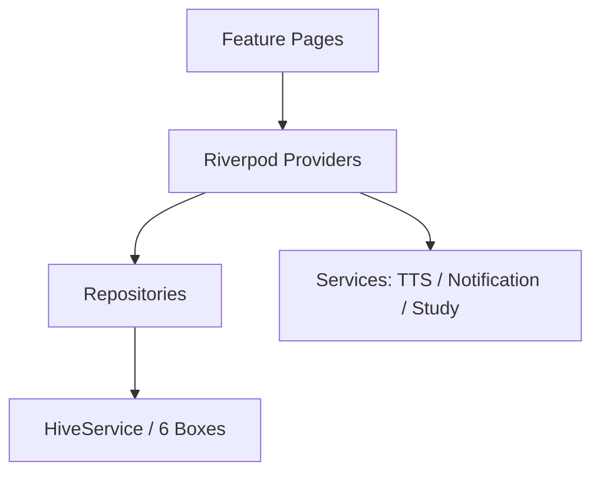

# VocabMaster 项目现状报告

> 分析基准：`E:\FlutterProject\vocab_master` · 版本 `1.0.0+1` · Flutter SDK `^3.12.2` · 更新日期：2026-06-29

---

## 1. 项目概览

VocabMaster 是一款**本地化**英语词汇学习应用，数据全部存储在设备本地（Hive），无后端服务。支持 Android、iOS、Windows 桌面与 Web 构建，当前主流程围绕「单词书 → 关卡 → 学习/测试」展开。

| 维度 | 现状 |
|------|------|
| 架构 | Feature 分层 + Repository + Service |
| 状态管理 | Flutter Riverpod 2.x（手写 Provider，未使用 `@riverpod` 代码生成） |
| 本地存储 | Hive 6 个 Box + SharedPreferences（会话筛选偏好） |
| 测试 | 38 个测试文件，**93** 项单元/集成测试通过 |
| 内置词库 | `cet4_1.json`、`test_40.json`（已移除 KyleBing 词库） |

---

## 2. 已实现的主要功能模块

### 2.1 应用启动与导航

- **首次引导**（`OnboardingPage`）：3 页滑动介绍，完成后写入 `hasSeenOnboarding`
- **主壳**（`MainShell`）：底部 4 Tab — 首页 / 单词书 / 查单词 / 我的
- **路由**（`AppRouter`）：命名路由 + 部分 `MaterialPageRoute` 直推

### 2.2 单词书与关卡

- **词书列表**（`BooksPage`）：分类筛选、下拉刷新、显示学习进度
- **关卡列表**（`LevelSelectionPage`）：
  - **学习 Tab**：按关（每关 30 词）进入 `WordDetailPage` 逐词浏览
  - **测试 Tab**：选择题 / 拼写 / 听音三种关卡挑战，满分得星
- **内置词库导入**：首次启动导入 CET-4；`test_40` 测试书自动维护/升级
- **自定义词书**（`CreateBookPage`）：代码完整，但入口极窄（见「未完成」）
- **词书管理子功能**（在 `BookDetailPage` 内）：编辑、单词管理、浏览、统计图表、导出、重置进度、删除 — **页面已实现，但主流程未接入**

### 2.3 学习系统

| 模式 | 页面 | 说明 |
|------|------|------|
| 选择题 | `QuizPage` | 看英文选中文，四选一 |
| 拼写 | `SpellingPage` | 看中文拼英文，支持首字母提示 |
| 听音选义 | `ListeningPage` | TTS 播放 + 四选一 |

- **学习调度**（`StudyProgress`）：简化间隔重复（非 SM-2），记录熟悉度、复习间隔、错题标记
- **每日配额**：默认每日 20 词（`dailyGoal`），学完当日待学词后提示完成
- **学习队列**：支持按熟悉度 / 随机排序（`StudyQueueOrder`）
- **会话记录**：每次学习写入 `LearningSession` + `ReviewRecord`
- **完成弹窗**：普通完成 / 选择题错题回顾 / 复习完成 / 成就解锁

### 2.4 单词详情

- **WordDetailPage**：音标、释义、例句、短语、近义词、英英释义、词根词缀
- **自动朗读**：开启设置后进入/切换单词自动 TTS
- **手动发音**：英/美音按钮、例句朗读按钮
- **词内导航**：关卡学习模式下支持上一词/下一词与进度条

### 2.5 TTS 语音

- **TtsService**：`flutter_tts`，支持语速（0.2–1.0）、美式/英式口音
- **自动朗读**（`auto_read.dart`）：学习页 + 单词详情页统一逻辑
- **设置页试听**：`Practice makes perfect.` 可点击预览当前语速/口音

### 2.6 签到与积分

- **每日签到**（`MePage` + `PointsRepository`）：+50 积分，连续签到天数
- **签到日历**（7 日视图）
- **积分明细**（`PointsHistorySection` / `PointsHistoryPage`）
- **用户等级**：按积分映射等级（`resolveUserLevel`）

### 2.7 统计与历史

- **我的页整体统计**：今日学习、连续打卡、已学/总量、掌握率
- **学习会话历史**（`SessionHistoryPage`）：筛选、分组、导出 CSV/JSON、分享、周报卡片
- **会话详情**（`SessionDetailPage`）：单词级回顾
- **词书级图表**（在 `BookDetailPage`）：学习日历、趋势图、正确率图（fl_chart）

### 2.8 设置

- 自动朗读、朗读语速（含试听）、发音口音
- 外观主题（跟随系统 / 浅色 / 深色）
- 每日提醒 + 提醒时间（**仅 Android/iOS 有效**）
- 关于页

### 2.9 成就系统（后端逻辑）

- 11 项成就定义（`achievements.dart`）
- 学习结束时评估并弹窗（`AchievementUnlockDialog`）
- 解锁 ID 持久化在 `UserSettings.unlockedAchievementIds`
- **无成就列表页**（只能被动弹窗看到）

### 2.10 导出与分享

- 词书导出、词书统计导出、会话导出
- 学习完成/周报/会话分享（`share_plus`）
- 图片保存（`gal`，移动端相册）

### 2.11 通知提醒

- 每日学习提醒 + 每周周报（`NotificationService` + `timezone`）
- 启动与保存设置时同步调度
- **Windows / Web / 桌面端：静默跳过，不推送**

---

## 3. 核心页面列表

### 3.1 主导航（Bottom Tab）

| Tab | 页面 | 路径 | 状态 |
|-----|------|------|------|
| 首页 | `HomePage` | `features/home/` | ✅ 入口页（背单词 / 查单词） |
| 单词书 | `BooksPage` | `features/books/` | ✅ 主学习入口 |
| 查单词 | `WordLookupPage` | `features/search/` | ❌ **空壳占位** |
| 我的 | `MePage` | `features/stats/` | ✅ 签到、统计、设置入口 |

### 3.2 学习流程页面

| 页面 | 作用 | 可达性 |
|------|------|--------|
| `OnboardingPage` | 首次引导 | ✅ 自动 |
| `LevelSelectionPage` | 关卡列表（学习/测试） | ✅ 从词书列表进入 |
| `WordDetailPage` | 单词详情 + 关卡逐词学习 | ✅ 从关卡「学习」Tab |
| `StudySessionPage` | 学习会话容器 | ✅ 关卡挑战 / 词书详情（间接） |
| `QuizPage` / `SpellingPage` / `ListeningPage` | 三种学习模式 | ✅ |
| `BookSelectionPage` | 多选词书混合学习 | ⚠️ **仅有路由，主 UI 无入口** |

### 3.3 词书管理页面

| 页面 | 作用 | 可达性 |
|------|------|--------|
| `BookDetailPage` | 词书详情、图表、学习入口、管理菜单 | ⚠️ **主流程未链接** |
| `BookWordsPage` | 浏览词书单词列表 | ⚠️ 仅经 `BookDetailPage` |
| `ManageWordsPage` | 增删改单词 | ⚠️ 仅经 `BookDetailPage` |
| `EditBookPage` | 编辑词书信息 | ⚠️ 仅经 `BookDetailPage` |
| `CreateBookPage` | 创建自定义词书 | ⚠️ 仅经 `add_to_custom_book_sheet`（本身未挂载） |
| `ImportBookPage` | JSON 导入词书 | ❌ **无任何导航入口** |
| `AddWordPage` | 添加单词 | ⚠️ 经 `ManageWordsPage` |

### 3.4 用户与统计页面

| 页面 | 作用 | 可达性 |
|------|------|--------|
| `MePage` | 个人中心 | ✅ |
| `PointsHistoryPage` | 积分明细 | ✅ 从我的页进入 |
| `SettingsPage` | 设置 | ✅ |
| `AboutPage` | 关于 | ✅ |
| `SessionHistoryPage` | 学习历史 | ⚠️ 主要从 `BookDetailPage`（主流程不可达） |
| `SessionDetailPage` | 单次会话详情 | ⚠️ 经历史页 |

---

## 4. 数据存储结构

### 4.1 Hive Box 一览

| Box 名称 | 存储类型 | Key 规则 | 用途 |
|----------|----------|----------|------|
| `books` | `Book` | `bookId` | 所有单词书及嵌套单词数据 |
| `settings` | `UserSettings` | 固定 `'default'` | 用户设置、打卡、积分、成就 |
| `sessions` | `LearningSession` | `session.id` | 学习会话记录 |
| `review_records` | `ReviewRecord` | `record.id` | 单词级复习/答题记录 |
| `level_challenges` | `LevelChallengeProgress` | `{bookId}_{levelIndex}` | 关卡星级进度 |
| `point_transactions` | `PointTransaction` | `transaction.id` | 积分流水 |

### 4.2 Hive TypeAdapter（typeId）

| typeId | 模型 | 说明 |
|--------|------|------|
| 0 | `Book` | 单词书 |
| 1 | `BookWord` | 单词（含学习状态字段） |
| 2 | `BookWordExample` | 例句 |
| 3 | `MemoryTips` | 记忆技巧 |
| 4 | `WordDefinition` | 结构化释义 |
| 5 | `WordExample` | 结构化例句 |
| 6 | `WordPhrase` | 搭配短语 |
| 7 | `ConfusableWord` | 易混词 |
| 8 | `UserSettings` | 用户设置 |
| 9 | `LearningSession` | 学习会话 |
| 10 | `ReviewRecord` | 复习记录 |
| 11 | `LevelChallengeProgress` | 关卡挑战 |
| 12 | `PointTransaction` | 积分交易 |

### 4.3 BookWord 关键学习字段

```
masteryLevel, lastReviewTime, reviewCount, correctStreak,
easeFactor, sm2Interval（字段名遗留，实际存复习间隔天数）,
isFavorite, inWrongBook
```

### 4.4 UserSettings 主要字段

| 字段 | 默认值 | UI 是否暴露 |
|------|--------|-------------|
| `dailyGoal` | 20 | ❌ 设置页已移除 |
| `autoReadEnabled` | true | ✅ |
| `speechRate` / `ttsAccent` | 0.45 / en-US | ✅ |
| `themeMode` | system | ✅ |
| `reminderEnabled` / `reminderTime` | false / 20:00 | ✅（移动端有效） |
| `allowExtraStudy` | false | ❌ 无 UI |
| `quizPickEnglish` | true | ❌ 无 UI，代码固定英→中 |
| `defaultStudyMode` | quiz | ❌ 无 UI |
| `weeklyReportEnabled` | true | ❌ 无 UI |
| `pointsBalance` / `checkInStreak` | 0 | ✅ 展示 |
| `displayName` | 学习者 | ❌ 不可编辑 |
| `unlockedAchievementIds` | [] | ❌ 无列表页 |

### 4.5 其他存储

- **SharedPreferences**：`SessionFilterPrefs`（会话历史筛选状态）
- **Assets**：`assets/books/cet4_1.json`、`test_40.json`、`assets/icon/`
- **导出文件**：写入应用文档目录（`path_provider`），支持 CSV/JSON/PNG

### 4.6 数据访问层（Repository）

| Repository | 职责 |
|------------|------|
| `BookRepository` | 词书 CRUD、进度统计、导入导出 |
| `WordRepository` | 单词读写、收藏、错题、复习队列 |
| `SettingsRepository` | 设置读写、打卡天数、复习记录 |
| `SessionRepository` | 学习会话生命周期 |
| `StatsRepository` | 日统计、周报、正确率趋势 |
| `LevelChallengeRepository` | 关卡星级 |
| `PointsRepository` | 签到、积分流水 |

---

## 5. 状态管理（Riverpod Provider）

### 5.1 Provider 文件与职责

| 文件 | 主要 Provider | 类型 |
|------|---------------|------|
| `settings_provider.dart` | `settingsProvider` | `AsyncNotifierProvider` |
| | `todayStudyCountProvider` | `FutureProvider` |
| `book_provider.dart` | `booksProvider` | `AsyncNotifierProvider` |
| | `bookProgressProvider` | `FutureProvider.family` |
| | `bookWordsProvider` | `FutureProvider.family` |
| | `globalOverviewStatsProvider` | `FutureProvider` |
| `study_provider.dart` | `selectedBookIdsProvider` | `NotifierProvider` |
| | `studyWordsProvider` | `FutureProvider.family` |
| | `dailyQuotaRemainingProvider` | `FutureProvider` |
| | `navigationIndexProvider` | `StateProvider` |
| | `currentStudySessionProvider` | `StateProvider` |
| | `ttsServiceProvider` / `studyServiceProvider` | `Provider` |
| | `invalidateStudyData()` | 批量失效工具函数 |
| `review_provider.dart` | `todayReviewWordsProvider` | `FutureProvider.family` |
| `points_provider.dart` | `checkInStatusProvider` | `Provider` |
| | `pointsHistoryProvider` | `FutureProvider` |
| `stats_provider.dart` | `recentSessionsProvider` | `FutureProvider` |
| | `last7DaysStatsProvider` | `FutureProvider` |
| | `bookDailyStatsProvider` | `FutureProvider.family` |
| `achievements_provider.dart` | `achievementsProvider` | `FutureProvider` |
| `session_detail_provider.dart` | `sessionDetailProvider` | `FutureProvider.family` |
| `export_refresh_provider.dart` | `exportFilesRevisionProvider` | `StateProvider` |
| `word_provider.dart` | 仅 re-export `word_repository` | — |

### 5.2 状态流示意



### 5.3 注意事项

- `riverpod_annotation` / `riverpod_generator` 在 `pubspec.yaml` 中声明，**但 lib 内未使用代码生成**
- 部分 Provider 直接读 `settingsRepository` 而非 `settingsProvider`，存在轻微状态源分裂
- `invalidateStudyData()` 是学习后刷新数据的核心枢纽

---

## 6. 服务层

| 服务 | 文件 | 功能 |
|------|------|------|
| `TtsService` | `tts_service.dart` | 单例 TTS，语速/口音/朗读/停止 |
| `StudyService` | `study_service.dart` | 答题评分、写复习记录、更新打卡 |
| `NotificationService` | `notification_service.dart` | 本地通知调度（移动端） |
| `HiveService` | `hive_service.dart` | Box 初始化、词库种子、CRUD |

---

## 7. 尚未完成 / 存在问题

### 7.1 空壳或未接入 UI 的功能

| 项目 | 现状 |
|------|------|
| **查单词页** | `WordLookupPage` 仅空 `Scaffold`，底部 Tab 占位 |
| **复习模式** | `reviewOnly: true` 的 `StudySessionPage` + `todayReviewWordsProvider` 已实现，**无入口** |
| **收藏 / 错题本** | 数据字段 + `StudyService.toggleFavorite` 存在，**无 UI、无专项学习入口** |
| **BookDetailPage** | 功能丰富（图表、导出、历史、直接学习），**主词书列表未链接** |
| **BookSelectionPage** | 多选混合学习完整，**仅路由注册，无按钮入口** |
| **ImportBookPage** | 导入逻辑完整，**无任何导航入口** |
| **CreateBookPage** | 仅 `add_to_custom_book_sheet` 引用，而该 Sheet **未被任何页面调用** |
| **成就列表页** | 仅有解锁弹窗，无法查看全部成就进度 |
| **用户昵称编辑** | `displayName` 固定「学习者」 |

### 7.2 设置项有模型无 UI

- `dailyGoal`（每日目标）— 仍影响学习配额，但设置页已移除调节入口
- `allowExtraStudy`（加练模式）— 关闭时严格限每日词数
- `quizPickEnglish` — 模型默认 true，代码写死 `pickEnglish: false`（仅英→中）
- `defaultStudyMode` — 无选择入口
- `weeklyReportEnabled` — 无开关，默认开启

### 7.3 平台能力缺口

- **推送提醒**：Windows / Web 不支持（设置页已有说明）
- **成就文案**：`all_modes` 描述仍为「5 种学习模式」，实际仅 3 种

### 7.4 架构/代码遗留

- `sm2Interval` 字段名仍保留（算法已换为 `StudyProgress`）
- `session_labels` 仍映射旧 `flashcard` 类型（兼容历史数据）
- `BookDetailPage` 中 `import_book_page.dart` 为**未使用 import**
- 部分导出/分享/图表组件已实现，因 `BookDetailPage` 不可达而**间接闲置**

### 7.5 测试覆盖盲区

- 无 Widget/集成测试覆盖主 UI 流程
- 无 `auto_read`、设置页试听等新增功能的专项测试
- 查单词、复习入口等缺失功能亦无测试需求（因未实现）

---

## 8. 主用户路径（当前实际可用）

```
启动 → 引导（首次）→ MainShell
  ├─ 首页 → 跳转「单词书」Tab
  ├─ 单词书 → 选书 → 关卡列表
  │     ├─ 学习 Tab → 单词详情（逐词浏览 + TTS）
  │     └─ 测试 Tab → 选择题/拼写/听音挑战（得星）
  ├─ 查单词 → （空）
  └─ 我的 → 签到 / 积分 / 统计 / 设置
```

---

## 9. 建议开发优先级

1. 词书列表增加进入 `BookDetailPage` 的入口（或合并详情能力到现有关卡页）
2. 实现 `WordLookupPage` 查词功能
3. 恢复复习模式入口
4. 接通 `BookSelectionPage` 或明确废弃
5. 收藏/错题本 UI 与专项练习
6. 成就列表页 + 修正成就文案

---

## 10. 总结

VocabMaster 已具备较完整的**本地词书学习内核**：关卡制学习、三种练习模式、TTS、学习进度调度、签到积分、会话记录与导出能力。近期迭代已移除 KyleBing 词库、SM-2 和闪卡模式，并补齐了自动朗读与设置页语速试听。

当前最大差距在**产品层连接**：大量已实现页面（词书详情、导入、多选学习、复习、收藏错题、查单词）**未挂到主导航**，用户实际能走通的路线比代码能力窄得多。