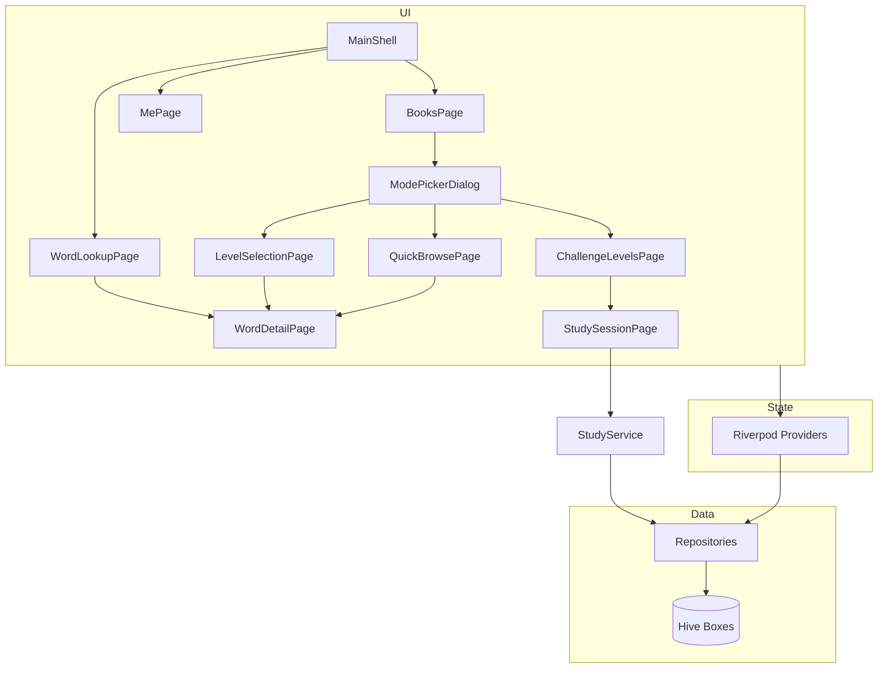

# VocabMaster 项目现状报告

> 生成日期：2026-06-30  
> 版本：1.0.0+1  
> SDK：Dart ^3.12.2 / Flutter

---

## 1. 项目概述

**VocabMaster** 是一款面向 Android、iOS、Windows、Web 的英语单词学习应用。数据全部存储在本地（Hive），无后端服务。当前产品形态聚焦「内置词书 → 三模式学习（速刷/正常/挑战）→ 签到积分」核心闭环。

### 技术栈

| 类别 | 选型 |
|------|------|
| UI 框架 | Flutter + Material 3 |
| 状态管理 | `flutter_riverpod` + `riverpod_annotation`（代码生成） |
| 本地存储 | `hive` / `hive_flutter` |
| 语音 | `flutter_tts` |
| 通知 | `flutter_local_notifications` + `timezone` |
| 其他 | `intl`、`shared_preferences`、`path_provider` |

### 质量指标

- **单元/集成测试**：57 项，全部通过
- **静态分析**：`flutter analyze` 无 error（仅 warning/info）
- **构建**：Windows Release 构建通过

---

## 2. 项目结构

```
lib/
├── main.dart                 # 启动、Hive 初始化、通知同步
├── core/
│   ├── hive/hive_service.dart    # Hive 盒子、schema 迁移、词书导入
│   ├── router.dart               # 命名路由与 push 辅助方法
│   ├── theme.dart                # 亮/暗主题
│   ├── study_mode.dart           # 学习模式枚举
│   ├── session_labels.dart       # 会话类型文案
│   ├── category_labels.dart      # 词书分类标签
│   └── points_constants.dart     # 积分常量
├── models/
│   └── book_model.dart           # Book / BookWord 及富内容子类型
├── repositories/             # 数据访问层
├── providers/                # Riverpod Provider（代码生成）
├── services/                 # StudyService、TtsService、NotificationService
├── features/
│   ├── shell/main_shell.dart     # 底部导航壳
│   ├── home/home_page.dart       # 首页
│   ├── books/                    # 单词书、关卡、速刷、挑战
│   │   └── widgets/
│   │       ├── book_mode_picker_dialog.dart  # 三模式选择弹窗
│   │       └── book_flow_bottom_nav.dart     # 词书流程共用底部导航
│   ├── study/                    # 学习会话 & 单词详情
│   ├── search/word_lookup_page.dart  # 查单词（搜索 + 跳转详情）
│   ├── me/me_page.dart           # 我的
│   ├── settings/settings_page.dart
│   └── about/about_page.dart
├── utils/                    # 工具函数（含 book_content_utils 富内容校验）
└── widgets/                  # 通用组件

assets/
├── books/test_40.json        # 40 词富内容标准词库
└── icon/app_icon.png

test/                         # 20 个测试文件，57 个用例
```

---

## 3. 导航与页面

### 3.1 启动流程

```
main()
  → HiveService.init()
      → BookWord schema 迁移检查（v4，变更时清空 books box）
      → 打开全部 Hive box
  → HiveService.importInitialBooks()
      → importBundledBooksIfNeeded()
  → TtsService / NotificationService 初始化
  → ProviderScope → MaterialApp(home: MainShell)
```

初始化失败时自动 `resetAllBoxes()` 后重试。

### 3.2 底部导航（MainShell）

| Tab | 页面 | 状态 |
|-----|------|------|
| 首页 | `HomePage` | ✅ 快捷入口 |
| 单词书 | `BooksPage` | ✅ 动态分类筛选、词书列表、进度展示 |
| 查单词 | `WordLookupPage` | ✅ 英文/中文搜索，跳转 `WordDetailPage` |
| 我的 | `MePage` | ✅ 签到、积分、统计、设置入口 |

### 3.3 子页面（Navigator push）

| 页面 | 入口 | 功能 |
|------|------|------|
| 模式选择弹窗 | 点击词书 | 速刷 / 正常 / 挑战 三选一 |
| `QuickBrowsePage` | 速刷模式 | 分页浏览词表，点击进入详情 |
| `LevelSelectionPage` | 正常模式 | 关卡网格，关卡内浏览学习 |
| `ChallengeLevelsPage` | 挑战模式 | 关卡网格，选模式后进入测试 |
| `WordDetailPage` | 关卡学习 / 查单词 | 单词详情（释义、例句、TTS） |
| `StudySessionPage` | 挑战模式 | 选择题 / 拼写 / 听音挑战 |
| `SettingsPage` | 我的页 | 学习/TTS/主题/提醒设置 |
| `AboutPage` | 设置页 | 应用介绍 |
| `PointsHistoryPage` | 我的页 | 完整积分流水 |

词书子流程页面（关卡列表、挑战列表）底部使用 `BookFlowBottomNav`，可一键返回 MainShell 各 Tab。

### 3.4 主用户路径

```
MainShell
  └─ 单词书 → 选词书 → 三模式弹窗
        ├─ 速刷 → QuickBrowsePage → WordDetailPage
        ├─ 正常 → LevelSelectionPage → WordDetailPage（浏览，记录关卡进度）
        └─ 挑战 → ChallengeLevelsPage → StudySessionPage（写学习记录 + 星级）
  └─ 查单词 → 搜索 → WordDetailPage
  └─ 我的 → 签到 / 积分 / 设置
```

---

## 4. 已实现核心功能

### 4.1 词书与关卡

- 首次启动从 `assets/books/` 批量导入内置词书（当前仅 `test_40.json`）
- `BookRepository.refreshBundledBooks()` 下拉刷新时重新导入
- 分类 Tab 按已加载词书的 `category` 字段动态生成（不再使用静态 `bookCategories` 列表）
- 每本书按 **30 词/关** 切分关卡（`splitWordsIntoLevels`）
- 关卡卡片显示星星数（0–3），来自挑战满分记录

### 4.2 学习模式

| 模式 | 页面 | 说明 |
|------|------|------|
| 速刷浏览 | `QuickBrowsePage` + `WordDetailPage` | 快速翻页浏览 |
| 正常学习 | `WordDetailPage` | 单词卡片、多 Tab 详情、自动朗读 |
| 选择题 | `QuizPage` | 四选一，英→中 |
| 拼写练习 | `SpellingPage` | 根据释义拼写英文 |
| 听音选义 | `ListeningPage` | TTS 播放后选择释义 |

测试完成后弹出 `QuizCompleteDialog`，支持再来一轮或返回。

答题结果通过 `StudyService.recordAnswer(isCorrect: bool)` 记录，答对即将 `BookWord.learned` 置为 `true`。

### 4.3 富内容词书

- `test_40.json` 为富内容标准格式（例句、短语、近义词、词根等结构化字段）
- `book_content_utils.isRichBookWord()` 识别富内容词
- 富内容词跳过 `WordEnrichment.apply` 写回 Hive，直接展示 JSON 内嵌数据
- 非富内容词（仅测试/兜底场景）仍可由 `WordEnrichment` 补全释义与例句

### 4.4 关卡挑战与星级

- 会话类型：`level_{bookId}_{levelIndex}_challenge_{mode}`
- 满分（100% 正确率）记录一种模式完成，最多 3 颗星（三种模式各 1 颗）
- 进度存于 `LevelChallengeProgress`（Hive）

### 4.5 学习进度

- 答对：`BookWord.learned = true`（答错不改变）
- 每次答题经 `StudyService.recordAnswer()` 落库：每天每词最多一条 `AnswerRecord`（同日重复答题覆盖 `answeredAt`）
- 进行中的练习仅用内存 `StudySessionProgress` 计数（不落盘）
- **无**学习会话历史、周报推送、间隔重复调度、每日配额、复习队列

### 4.6 TTS 与自动朗读

- `TtsService` 单例，支持美式/英式口音、语速调节
- 设置页可试听语速
- `auto_read.dart`：学习页根据 `autoReadEnabled` 自动发音

### 4.7 签到与积分

- 每日签到 +50 积分（`PointsConstants.dailyCheckInReward`）
- 连续签到天数、7 日签到日历
- 用户等级 `resolveUserLevel()`（按积分分段）
- 积分流水 `PointTransaction` 持久化

### 4.8 通知提醒

- 每日学习提醒（可设时间，默认 20:00），文案基于今日 `AnswerRecord` 汇总
- 桌面端 / Web 显示不支持推送的提示，设置仍会保存

### 4.9 设置

| 设置项 | 存储字段 | UI |
|--------|----------|-----|
| 自动朗读 | `autoReadEnabled` | ✅ |
| 朗读语速 | `speechRate` | ✅ + 试听 |
| 发音口音 | `ttsAccent` | ✅ 美/英 |
| 主题模式 | `themeMode` | ✅ 系统/浅/深 |
| 每日提醒 | `reminderEnabled` + `reminderTime` | ✅ |

---

## 5. 数据结构

### 5.1 Hive 存储盒子

| Box 名称 | 模型 | 用途 |
|----------|------|------|
| `books` | `Book` / `BookWord` | 词书及单词 |
| `settings` | `UserSettings` | 用户设置（单条 key=`default`） |
| `answer_records` | `AnswerRecord` | 答题记录（每天每词一条，统计来源） |
| `level_challenges` | `LevelChallengeProgress` | 关卡挑战星级 |
| `level_study` | `LevelStudyProgress` | 正常模式关卡浏览进度 |
| `point_transactions` | `PointTransaction` | 积分流水 |

打开失败时 `_openBoxOrReset` 自动删盘重建。

### 5.2 BookWord 模型（Hive schema v4）

`BookWord` 共 **15 个连续 `@HiveField`**，不再保留 SM-2 遗留字段：

| 索引 | 字段 | 说明 |
|------|------|------|
| 0–5 | `id`、`word`、音标、`partOfSpeech`、`definitionCn` | 基本信息 |
| 6 | `sentenceExamples` | 例句（JSON `examples` → `BookWordExample`） |
| 7 | `root` | 词根词缀 |
| 8 | `learned` | 是否已学习（答对过一次即为 `true`） |
| 9 | `definitions` | 中文释义列表 |
| 10 | `collocations` | 常用短语 |
| 11 | `memoryTips` | 记忆技巧 |
| 12 | `bookIds` | 所属词书 |
| 13 | `englishDefinitions` | 英文释义 |
| 14 | `synonymDetails` | 近义词（含中文说明） |

**计算属性**（不单独存 Hive）：

| 属性 | 来源 |
|------|------|
| `synonyms` | 从 `synonymDetails` 提取英文词列表 |
| `structuredExamples` | 从 `sentenceExamples` 读写，供 UI / `WordEnrichment` 使用 |
| `english` / `chinese` / `phonetic` | 兼容别名 |

**BookWordExample**（`@HiveType typeId: 2`）：

| 字段 | 说明 |
|------|------|
| `en` / `cn` | 例句英/中文（JSON 标准字段） |
| `partOfSpeech` / `meaning` | 可选，供 `WordEnrichment` 写入多义项例句 |

**Schema 迁移**：`HiveService` 在 `init()` 时检查 `book_word_hive_schema`（当前 v4）。版本不一致时删除 `books` box 并重新导入内置词书；签到、积分、挑战星级等其他 box 不受影响。词书 JSON 可选字段 `learned`（默认 `false`），运行时由答题更新。

### 5.3 AnswerRecord 字段

| 字段 | 说明 |
|------|------|
| `wordId` / `bookId` | 哪个词、哪本书 |
| `answeredAt` | 最近一次答题时间 |

写入策略：`SettingsRepository.upsertTodayAnswerRecord()` — 同一天同一 `wordId` 已存在则覆盖 `answeredAt`，否则新建。不区分对错，仅表示「今天答过这道题」。

### 5.4 整体统计与答题 API

| UI 展示 | 来源 |
|---------|------|
| 今日学习 | 今日 `AnswerRecord` 按 `wordId` 计数 |
| 连续学习 / 最长连续学习 | `UserSettings.studyStreak` / `longestStudyStreak`（有答题的天数，与签到无关） |
| 已学习 / 总词汇 | 全库 `learned` 聚合（`computeOverviewStats`，按英文词去重） |

挑战模式答题入口：`StudyService.recordAnswer(isCorrect: bool)`。

### 5.5 Riverpod Provider 一览

| 文件 | Provider | 说明 |
|------|----------|------|
| `repository_providers` | `*RepositoryProvider` × 6 | Repository 单例注入 |
| `settings_provider` | `settingsProvider`、`todayStudyCountProvider` | 设置与今日学习数 |
| `book_provider` | `booksProvider`、`bookProgressProvider`、`globalOverviewStatsProvider` | 词书进度 |
| `study_provider` | `ttsServiceProvider`、`studyServiceProvider`、`navigationIndexProvider` 等 | 学习/TTS/导航 |
| `points_provider` | `checkInStatusProvider`、`pointsHistoryProvider` 等 | 签到积分 |

---

## 6. 内置词库资源

| 文件 | bookId | 词数 | 用途 |
|------|--------|------|------|
| `test_40.json` | `TEST_40` | 40 | 富内容标准词库；2 关（30+10） |
| `cet4_core.json` | `CET4_CORE` | 4544 | 四级完整词库（CET4_1+2+3 合并去重；源库 7508 条含重复词条） |
| `cet6_core.json` | `CET6_CORE` | 3991 | 六级完整词库（CET6_1+2+3 合并去重；源库 5651 条） |
| `IELTS.json` | `IELTS` | 5275 | 雅思词库（IELTS_2+3 合并去重） |
| `kaoyan_core.json` | `KAOYAN_CORE` | 5047 | 考研词库（KaoYan_1+2+3 合并去重） |
| `TOEFL.json` | `TOEFL` | 10367 | 托福词库（TOEFL_2+3 合并去重） |
| `senior_core.json` | `SENIOR_CORE` | 6555 | 高中词库（GaoZhong+人教+北师大 合并去重） |
| `junior_core.json` | `JUNIOR_CORE` | 3118 | 初中词库（ChuZhong+人教+外研社 合并去重） |
| `SAT.json` | `SAT` | 4463 | SAT 词库（SAT_2+3 合并去重） |
| `GRE.json` | `GRE` | 9984 | GRE 词库（GRE_2+3 合并去重） |

词书 JSON 由 `Book.fromJson` 解析，导入时经 `book_content_utils` 校验并附加 `bookIds`。

---

## 7. 已移除功能（历史精简）

| 类别 | 已移除 |
|------|--------|
| 词库 | CET-4 内置词书 `cet4_1.json` |
| 服务 | `ai_service.dart`（未使用的 AI 占位） |
| 模型扩展 | `book_word_extensions.dart`（与 `book_model` 重复） |
| Provider | `word_provider.dart`（仅 re-export） |
| UI 组件 | `book_mode_picker_sheet.dart`（改为 `book_mode_picker_dialog`） |
| 学习系统 | SM-2、`ReviewRecord`、闪卡队列、每日配额、学习调度、`LearningSession` 持久化、周报推送 |
| 词书管理 | 创建/编辑/导入自定义词书 |
| 其他 | 成就系统、导出分享、fl_chart 图表 |
| **BookWord 旧字段** | `legacyExamples`、`structuredExamplesRich`、独立 `synonyms` 字段、`confusableWords`、`imageUrl`；HiveField 空洞索引（13–16） |

---

## 8. 扩充词库（路线 A）

### 8.1 添加一本新词书

1. 在 `assets/books/` 新建 `your_book.json`（格式对齐 `test_40.json`）
2. 词条模板见 `tools/book_word_template.json`
3. 内置词书生成：`python tools/build_cet4_core.py` / `build_cet6_core.py` / `build_ielts.py`，再运行 `python tools/validate_book_json.py`
4. 重启 App — `HiveService` 会自动扫描 `assets/books/*.json` 并导入（`_` 前缀文件跳过）
5. 若 JSON 中 `category` 为新值，在 `category_labels.dart` 补展示文案

### 8.2 词书 JSON 顶层字段

| 字段 | 说明 |
|------|------|
| `bookId` | 唯一 ID（建议大写+下划线，如 `CET4_CORE`） |
| `bookName` | 列表展示名称 |
| `description` | 简介 |
| `totalWords` | 词数（须与 `words` 数组长度一致） |
| `category` | 分类 key（对应 `category_labels`） |
| `difficulty` / `coverColor` | 可选展示信息 |
| `words` | 富内容词条数组 |

### 8.3 待开发

| 项目 | 说明 |
|------|------|
| **自定义词书** | 用户自行导入 JSON（非内置 assets） |

---

## 9. 测试覆盖

| 领域 | 测试文件 |
|------|----------|
| 词书模型 | `book_model_test`、`book_content_utils_test`、`test_book_import_test` |
| 关卡/挑战 | `level_utils_test`、`level_challenge_test`、`level_study_progress_test`、`test_40_flow_test` |
| 测验生成 | `quiz_generator_test` |
| 签到积分 | `check_in_utils_test` |
| 统计 | `overview_stats_test` |
| TTS | `tts_service_test` |
| 单词增强 | `word_enrichment_test`、`word_display_utils_test` |
| 其他工具 | `study_mode_test`、`phonetic_utils_test`、`quick_browse_utils_test` 等 |

---

## 10. 架构简图



---

## 11. 总结

VocabMaster 当前是一个**功能聚焦、本地优先**的单词学习 App：

- **成熟可用**：三模式词书学习、关卡挑战星级、查单词、TTS、签到积分、设置与通知
- **数据模型清晰**：`BookWord` 已对齐 `test_40` 富内容格式，学习状态简化为 `learned` 布尔；schema v4 自动迁移
- **架构清晰**：Feature 分层 + Repository + Riverpod + Hive 持久化
- **主要缺口**：真实词库体量、学习历史展示、自定义词书导入
- **可扩展**：在 `assets/books/` 添加 JSON 即可自动导入；新分类补 `category_labels.dart`

当前优先路线：**扩充 `assets/books/` 富内容词库**（校验脚本 `tools/validate_book_json.py`）。