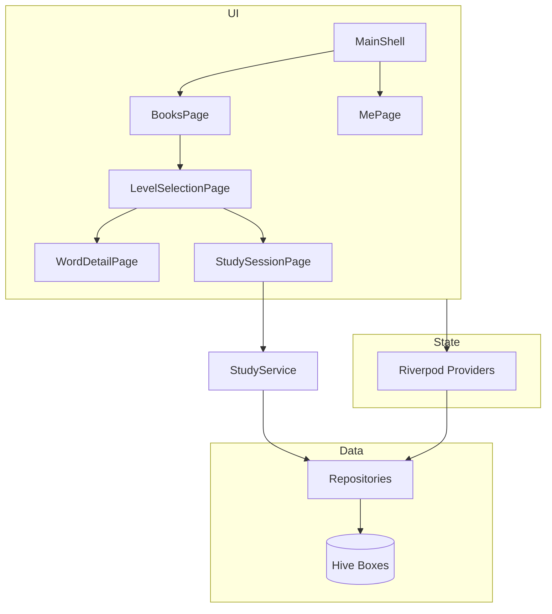

# VocabMaster 项目现状报告

> 生成日期：2026-06-30  
> 版本：1.0.0+1  
> SDK：Dart ^3.12.2 / Flutter

---

## 1. 项目概述

**VocabMaster** 是一款面向 Android、iOS、Windows、Web 的英语单词学习应用。数据全部存储在本地（Hive），无后端服务。当前产品形态已大幅精简，聚焦「内置词书 → 关卡学习/挑战 → 签到积分」核心闭环。

### 技术栈

| 类别 | 选型 |
|------|------|
| UI 框架 | Flutter + Material 3 |
| 状态管理 | `flutter_riverpod` + `riverpod_annotation`（代码生成） |
| 本地存储 | `hive` / `hive_flutter` |
| 语音 | `flutter_tts` |
| 通知 | `flutter_local_notifications` + `timezone` |
| 其他 | `intl`、`shared_preferences`、`path_provider` |

### 质量指标

- **单元/集成测试**：49 项，全部通过
- **静态分析**：无 error（仅 warning/info）
- **构建**：Windows Release 构建通过

---

## 2. 项目结构

```
lib/
├── main.dart                 # 启动、Hive 初始化、通知同步
├── core/
│   ├── hive/hive_service.dart    # Hive 盒子与词书导入
│   ├── router.dart               # 命名路由
│   ├── theme.dart                # 亮/暗主题
│   ├── study_mode.dart           # 学习模式枚举
│   ├── session_labels.dart       # 会话类型文案
│   ├── category_labels.dart      # 词书分类标签
│   └── points_constants.dart     # 积分常量
├── models/                   # Hive 数据模型（含 .g.dart）
├── repositories/             # 数据访问层（6 个 Repository）
├── providers/                # Riverpod Provider（代码生成）
├── services/                 # StudyService、TtsService、NotificationService
├── features/
│   ├── shell/main_shell.dart     # 底部导航壳
│   ├── home/home_page.dart       # 首页
│   ├── books/                    # 单词书 & 关卡
│   ├── study/                    # 学习会话 & 单词详情
│   ├── search/word_lookup_page.dart  # 查单词（占位）
│   ├── stats/me_page.dart        # 我的
│   ├── settings/settings_page.dart
│   └── about/about_page.dart
├── utils/                    # 工具函数
└── widgets/                  # 通用组件

assets/
├── books/cet4_1.json         # CET-4 词库（首次启动导入）
├── books/test_40.json        # 40 词测试词库
└── icon/app_icon.png

test/                         # 17 个测试文件，49 个用例
```

---

## 3. 导航与页面

### 3.1 启动流程

```
main()
  → HiveService.init() + 导入词书 + 默认设置
  → TtsService / NotificationService 初始化
  → ProviderScope → MaterialApp(home: MainShell)
```

初始化失败时自动 `resetAllBoxes()` 后重试。

### 3.2 底部导航（MainShell）

| Tab | 页面 | 状态 |
|-----|------|------|
| 首页 | `HomePage` | ✅ 快捷入口（跳转单词书 / 查单词） |
| 单词书 | `BooksPage` | ✅ 分类筛选、词书列表、进度展示 |
| 查单词 | `WordLookupPage` | ⚠️ **仅占位**，body 为空 |
| 我的 | `MePage` | ✅ 签到、积分、统计、设置入口 |

### 3.3 子页面（Navigator push）

| 页面 | 入口 | 功能 |
|------|------|------|
| `LevelSelectionPage` | 点击词书 | 关卡网格；「学习」Tab 浏览单词，「测试」Tab 挑战 |
| `WordDetailPage` | 关卡学习 Tab | 单词详情（释义、例句、TTS 自动朗读） |
| `StudySessionPage` | 关卡测试 Tab | 选择题 / 拼写 / 听音挑战 |
| `SettingsPage` | 我的页 | 学习/TTS/主题/提醒设置 |
| `AboutPage` | 设置页 | 应用介绍 |
| `PointsHistoryPage` | 我的页 | 完整积分流水 |

### 3.4 主用户路径

```
MainShell
  └─ 单词书 → 选词书 → 关卡列表
        ├─ 学习 Tab → WordDetailPage（浏览，不写测试进度）
        └─ 测试 Tab → 选模式 → StudySessionPage（写学习记录）
  └─ 我的 → 签到 / 积分 / 设置
```

---

## 4. 已实现核心功能

### 4.1 词书与关卡

- 首次启动从 `assets/books/cet4_1.json` 导入 CET-4 词书
- 自动导入/更新 `TEST_40` 测试词书（40 词，用于流程验证）
- 词书按分类 Tab 筛选（四级、六级、雅思、托福、测试等）
- 每本书按 **30 词/关** 切分关卡（`splitWordsIntoLevels`）
- 关卡卡片显示星星数（0–3），来自挑战满分记录

### 4.2 学习模式

| 模式 | 页面 | 说明 |
|------|------|------|
| 浏览学习 | `WordDetailPage` | 单词卡片、多 Tab 详情、自动朗读 |
| 选择题 | `QuizPage` | 四选一，英→中 |
| 拼写练习 | `SpellingPage` | 根据释义拼写英文 |
| 听音选义 | `ListeningPage` | TTS 播放后选择释义 |

测试完成后弹出 `QuizCompleteDialog`，支持再来一轮或返回。

### 4.3 关卡挑战与星级

- 会话类型：`level_{bookId}_{levelIndex}_challenge_{mode}`
- 满分（100% 正确率）记录一种模式完成，最多 3 颗星（三种模式各 1 颗）
- 进度存于 `LevelChallengeProgress`（Hive）

### 4.4 学习进度

- 答对：`masteryLevel`（熟悉度 0–5）+1，`reviewCount` +1
- 每次答题写入 `ReviewRecord`，更新学习连续天数
- 学习会话写入 `LearningSession`（开始/完成、正确率统计）
- **无**间隔重复调度、每日配额、复习队列

### 4.5 TTS 与自动朗读

- `TtsService` 单例，支持美式/英式口音、语速调节
- 设置页可试听语速
- `auto_read.dart`：学习页根据 `autoReadEnabled` 自动发音

### 4.6 签到与积分

- 每日签到 +50 积分（`PointsConstants.dailyCheckInReward`）
- 连续签到天数、7 日签到日历
- 用户等级 `resolveUserLevel()`：
  - Lv.1：0–199
  - Lv.2：200–499
  - Lv.3：500–999
  - Lv.4：1000–1999
  - Lv.5+：2000 起每 1000 分 +1 级
- 积分流水 `PointTransaction` 持久化

### 4.7 通知提醒

- 每日学习提醒（可设时间，默认 20:00）
- 每周日周报推送（随「每日提醒」开关联动）
- 桌面端 / Web 显示不支持推送的提示，设置仍会保存
- 文案由 `reminder_message.dart` 生成

### 4.8 设置

| 设置项 | 存储字段 | UI |
|--------|----------|-----|
| 自动朗读 | `autoReadEnabled` | ✅ |
| 朗读语速 | `speechRate` | ✅ + 试听 |
| 发音口音 | `ttsAccent` | ✅ 美/英 |
| 主题模式 | `themeMode` | ✅ 系统/浅/深 |
| 每日提醒 | `reminderEnabled` + `reminderTime` | ✅ |

---

## 5. 数据结构

### 5.1 Hive 存储盒子

| Box 名称 | 模型 | 用途 |
|----------|------|------|
| `books` | `Book` / `BookWord` | 词书及单词 |
| `settings` | `UserSettings` | 用户设置（单条 key=`default`） |
| `sessions` | `LearningSession` | 学习会话记录 |
| `review_records` | `ReviewRecord` | 单次答题记录 |
| `level_challenges` | `LevelChallengeProgress` | 关卡挑战星级 |
| `point_transactions` | `PointTransaction` | 积分流水 |

打开失败时 `_openBoxOrReset` 自动删盘重建。

### 5.2 核心模型字段

**Book / BookWord**

- 基本信息：`word`、`definitionCn`、音标、词性、释义列表、例句、搭配、记忆技巧等
- 学习状态：`masteryLevel`（0–5）、`reviewCount`、`correctStreak`、`lastReviewTime`
- 关联：`bookIds`

**UserSettings**

- 外观：`themeMode`
- 学习/TTS：`autoReadEnabled`、`speechRate`、`ttsAccent`
- 提醒：`reminderEnabled`、`reminderTime`
- 打卡：`currentStreak`、`longestStreak`、`lastStudyDate`
- 签到：`pointsBalance`、`checkInStreak`、`checkInDates`、`displayName` 等

**LearningSession**

- `sessionType`、`bookIds`、`wordsStudied`、`wordsCorrect`、`startedAt`、`completedAt`

**ReviewRecord**

- `wordId`、`bookId`、`quality`（1=again, 2=hard, 3=good）、`reviewedAt`

**LevelChallengeProgress**

- `bookId`、`levelIndex`、`completedModes`（quiz/spelling/listening）

### 5.3 Riverpod Provider 一览

| 文件 | Provider | 说明 |
|------|----------|------|
| `repository_providers` | `*RepositoryProvider` × 7 | Repository 单例注入 |
| `settings_provider` | `settingsProvider`、`todayStudyCountProvider` | 设置与今日学习数 |
| `book_provider` | `booksProvider`、`bookProgressProvider`、`globalOverviewStatsProvider` | 词书进度 |
| `study_provider` | `ttsServiceProvider`、`studyServiceProvider`、`currentStudySessionProvider`、`navigationIndexProvider` | 学习/TTS/导航 |
| `points_provider` | `checkInStatusProvider`、`pointsHistoryProvider`、`allPointsHistoryProvider` | 签到积分 |

---

## 6. 内置词库资源

| 文件 | bookId | 词数 | 用途 |
|------|--------|------|------|
| `cet4_1.json` | 导入时生成 | ~完整 CET-4 | 默认词书 |
| `test_40.json` | `TEST_40` | 40 | 开发测试；2 关（30+10） |

词书 JSON 由 `Book.fromJson` 解析，导入时自动附加 `bookIds`。

---

## 7. 已移除功能（历史精简）

以下功能曾在早期版本存在，**当前代码库已删除**：

| 类别 | 已移除 |
|------|--------|
| 引导 | OnboardingPage |
| 词书管理 | 创建/编辑/导入词书、词书详情、错题本/收藏夹管理 |
| 学习系统 | SM-2、闪卡、学习队列、每日配额、学习调度 |
| 成就 | 成就定义、解锁弹窗、成就 Provider |
| 导出分享 | CSV/JSON 导出、分享、学习记录历史页 |
| 其他 | `fl_chart` 图表、自定义词书 CRUD、收藏/错题本字段 |

---

## 8. 未完成 / 待开发

| 项目 | 说明 |
|------|------|
| **查单词页** | `WordLookupPage` 为空壳；`WordRepository.searchWords()` 已实现但未接入 UI |
| **学习记录 UI** | `LearningSession` 仍写入 Hive，但无历史列表页面 |
| **自定义词书** | Repository 已移除创建/编辑能力，仅支持内置 JSON 词库 |
| **pubspec 描述** | 仍写「自定义单词书」，与实际不符，建议更新 |

---

## 9. 测试覆盖

| 领域 | 测试文件 |
|------|----------|
| 词书模型 | `book_model_test` |
| 关卡/挑战 | `level_utils_test`、`level_challenge_test`、`test_40_flow_test` |
| 测验生成 | `quiz_generator_test` |
| 签到积分 | `check_in_utils_test` |
| 统计 | `overview_stats_test` |
| TTS | `tts_service_test` |
| 单词增强 | `word_enrichment_test` |
| 其他工具 | `study_mode_test`、`study_quality_test`、`phonetic_utils_test` 等 |

---

## 10. 架构简图



---

## 11. 总结

VocabMaster 当前是一个**功能聚焦、本地优先**的单词学习 App：

- **成熟可用**：词书关卡、三种测试模式、星级挑战、TTS、签到积分、设置与通知
- **架构清晰**：Feature 分层 + Repository + Riverpod 代码生成 + Hive 持久化
- **主要缺口**：查单词 UI、学习历史展示
- **技术债**：Hive 模型字段 index 留有空洞（兼容旧数据）；`pubspec` 描述需同步

建议下一步优先实现 **查单词页**（对接已有 `searchWords`），其次视需求决定是否恢复学习记录浏览或精简会话存储逻辑。